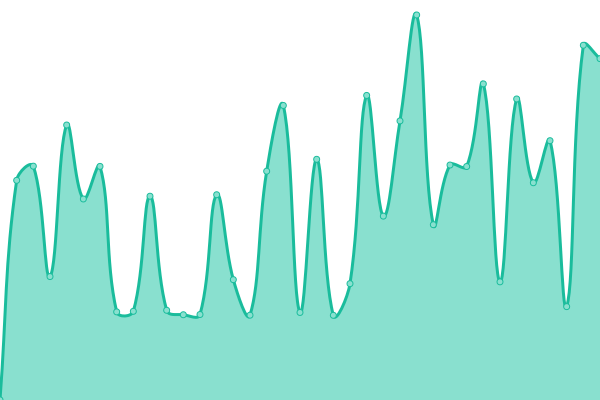

# [📈 Live Status](https://ijo42.github.io/psu-uptime): <!--live status--> **🟧 Partial outage**

This repository contains the open-source uptime monitor and status page for [Aleksandr](https://ijo42.ru), powered by [Upptime](https://github.com/upptime/upptime).

With [Upptime](https://upptime.js.org), you can get your own unlimited and free uptime monitor and status page, powered entirely by a GitHub repository. We use [Issues](https://github.com/ijo42/psu-uptime/issues) as incident reports, [Actions](https://github.com/ijo42/psu-uptime/actions) as uptime monitors, and [Pages](https://ijo42.github.io/psu-uptime) for the status page.

<!--start: status pages-->
<!-- This summary is generated by Upptime (https://github.com/upptime/upptime) -->
<!-- Do not edit this manually, your changes will be overwritten -->
<!-- prettier-ignore -->
| URL | Status | History | Response Time | Uptime |
| --- | ------ | ------- | ------------- | ------ |
|  [ETIS](https://student.psu.ru) | 🟩 Up | [etis.yml](https://github.com/ijo42/psu-uptime/commits/HEAD/history/etis.yml) | 

 1917ms
     
 | 

<a href="https://ijo42.github.io/psu-uptime/history/etis">100.00%</a>
    

|  [Main site](http://www.psu0.ru) | 🟥 Down | [main-site.yml](https://github.com/ijo42/psu-uptime/commits/HEAD/history/main-site.yml) | 

 2286ms
     
 | 

<a href="https://ijo42.github.io/psu-uptime/history/main-site">99.47%</a>
    

|  [Mail Server](https://mail.psu.ru) | 🟩 Up | [mail-server.yml](https://github.com/ijo42/psu-uptime/commits/HEAD/history/mail-server.yml) | 

 2004ms
     
 | 

<a href="https://ijo42.github.io/psu-uptime/history/mail-server">100.00%</a>
    

|  [Moodle](https://online.psu.ru) | 🟩 Up | [moodle.yml](https://github.com/ijo42/psu-uptime/commits/HEAD/history/moodle.yml) | 

 1684ms
     
 | 

<a href="https://ijo42.github.io/psu-uptime/history/moodle">100.00%</a>
    

<!--end: status pages-->

[**Visit our status website →**](https://ijo42.github.io/psu-uptime)

## 📄 License

- Powered by: [Upptime](https://github.com/upptime/upptime)
- Code: [MIT](./LICENSE) © [Aleksandr](https://ijo42.ru)
- Data in the `./history` directory: [Open Database License](https://opendatacommons.org/licenses/odbl/1-0/)
